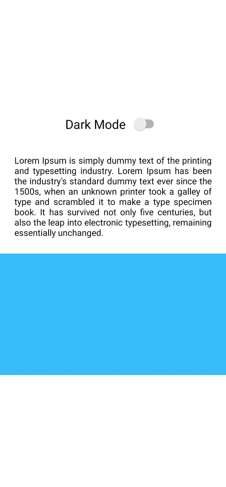

# Dark Theme React Native

- [React Native Expo](https://reactnative.dev/)
- [NativeWind](https://www.nativewind.dev/quick-starts/expo)


## Steps

- npx create-expo-app DarkTheme
- npm i nativewind
- npx tailwindcss init
```
// tailwind.config.js
module.exports = {
- content: [],
+ content: ["./App.{js,jsx,ts,tsx}", "./<custom directory>/**/*.{js,jsx,ts,tsx}"],
  theme: {
    extend: {},
  },
  plugins: [],
}

3. Add the Babel plugin

Modify your babel.config.js

// babel.config.js
module.exports = function (api) {
  api.cache(true);
  return {
    presets: ["babel-preset-expo"],
+   plugins: ["nativewind/babel"],
  };
};
```

## Run App
- npx expo start -w
- expo start --tunnel
- Scan QR Code By Your Phone android or ios


### Light



### Dark
